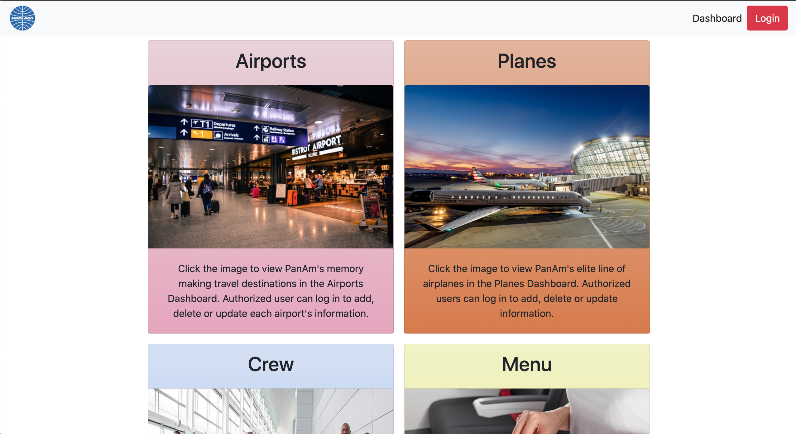
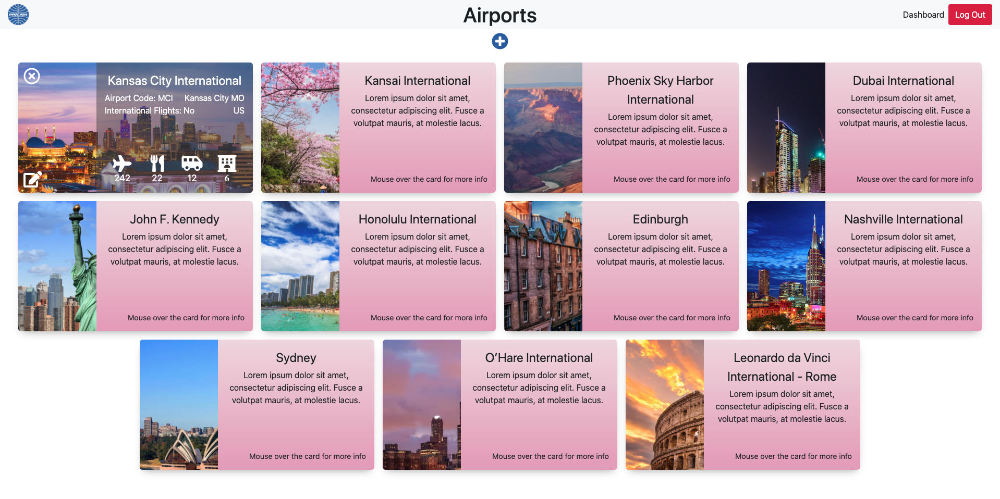
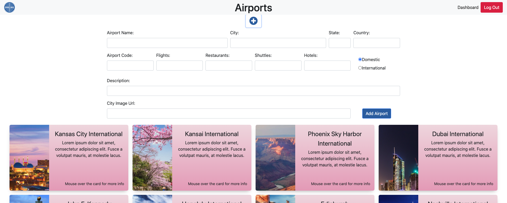
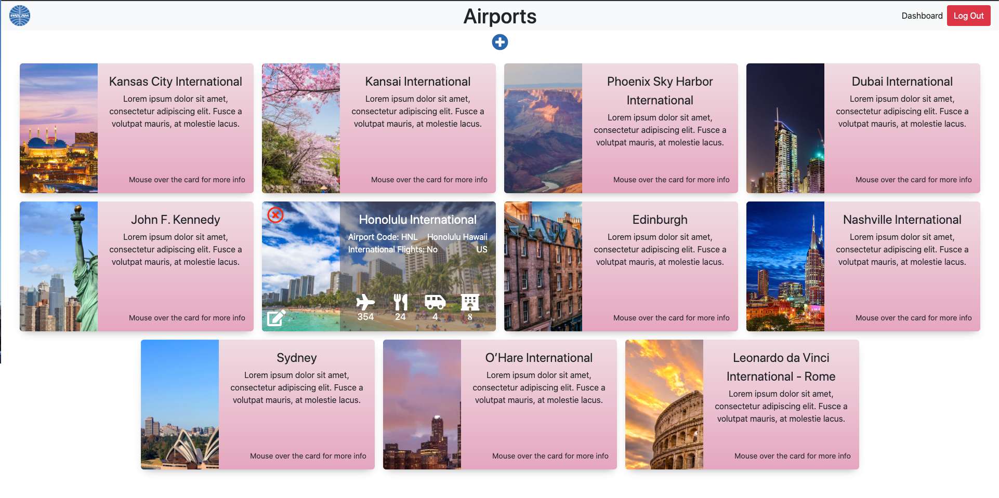
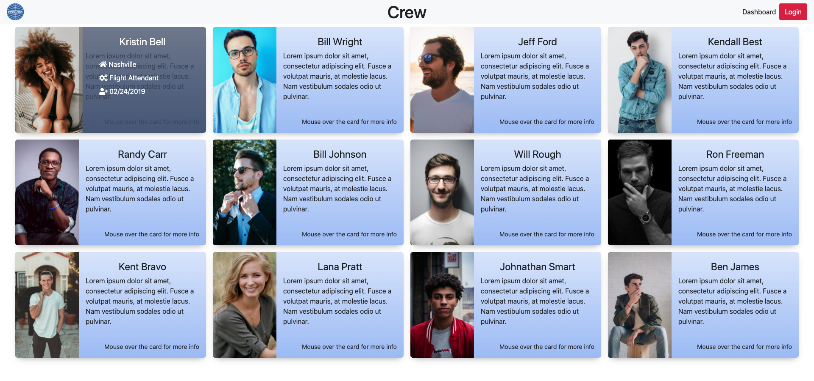
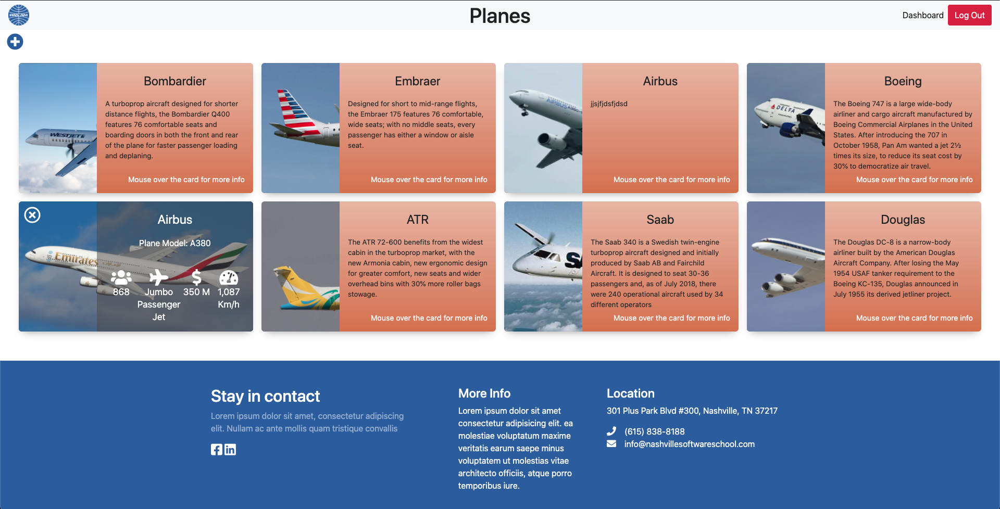
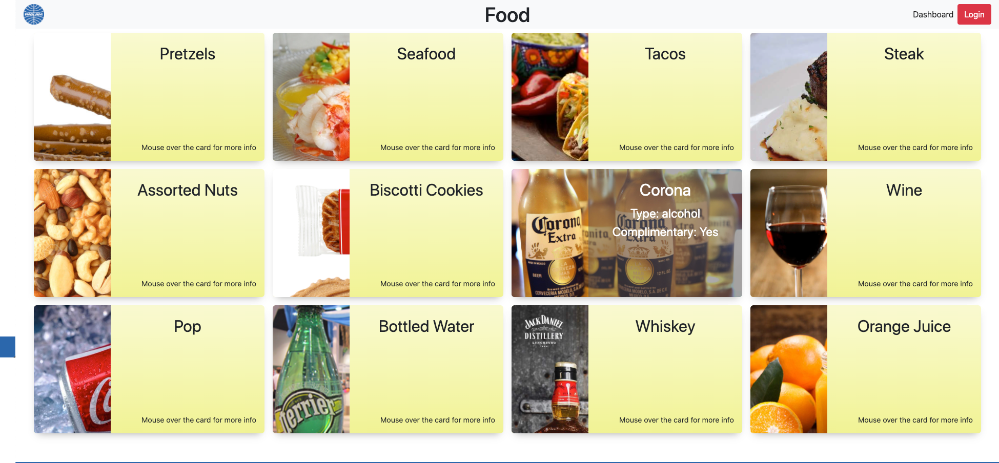
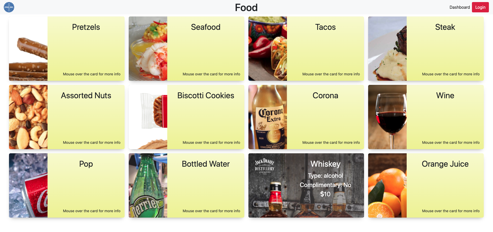

# PanAm nutshell-droids

## Technologies Used

* HTML5, CSS and JavaScript
* jQuery
* SASS
* Bootstrap
* Webpack
* ES6 modules
* Firebase

## Description

PanAm is a mock site for a revived airline, PanAm, that dissolved in 1991. The goal was to create a dashboard that was viewable to any user and only authorized users could add, update, and delete items in the dashboard menus.

## ScreenShots

**Dashboard Overview**

**Airport Dashboard View**

**Add New Airport Form**

**Edit and Delete Airports ONLY for authorized users**

**Logged Out View of Crew Dashboard**

**View of Airplanes Dashboard**

**Food Dashboard showing Complimentary Item**

**Food Dashboard showing item and cost**

## How to run

## Contributors

[Sarah Holder](https://github.com/sarahholder)

[Stephen Castaneda](https://github.com/stephencastaneda)

[Kenny McEastland](https://github.com/kenymc1)
